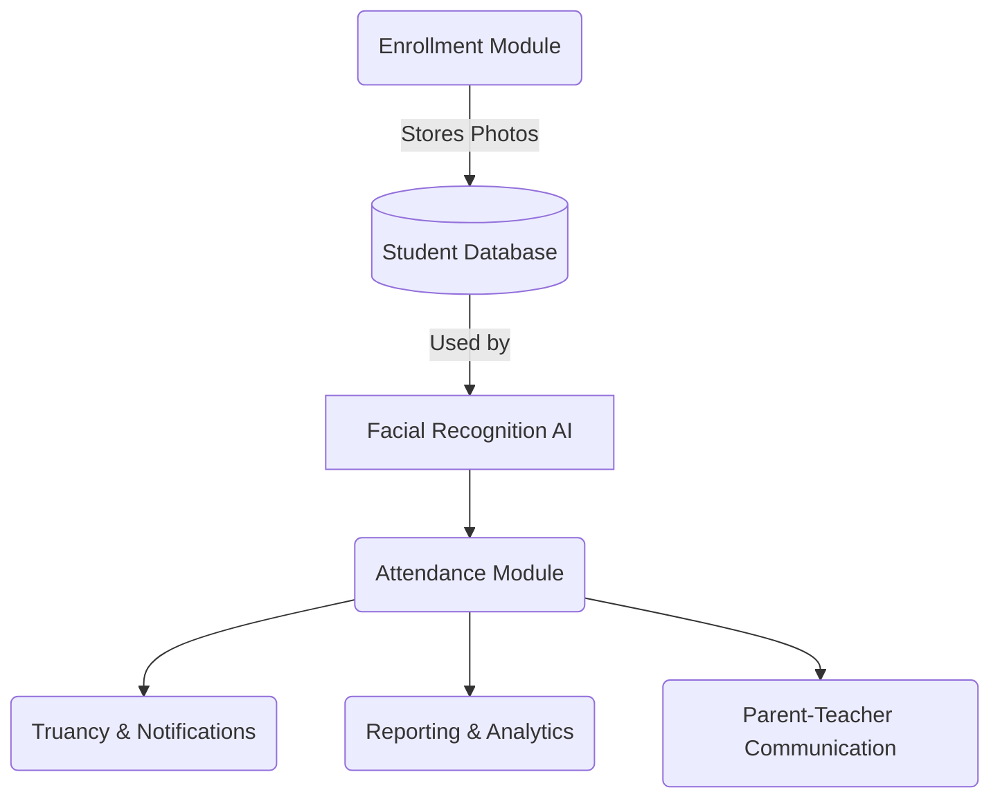

# School Management System

## Overview

The School Management System is a digital platform designed to streamline and enhance the daily operations of a school, with a special focus on automating attendance management. By leveraging Artificial Intelligence (AI), such as facial recognition, the system improves the accuracy and efficiency of attendance tracking while fostering better communication among students, teachers, and parents.

---

## Objectives

- **Efficient Attendance Management:** Replace manual, paper-based processes with a faster, more reliable digital system.
- **Resource Conservation:** Reduce the consumption of ink and paper by digitizing attendance and communication.
- **School-wide Integration:** Require all learners to be enrolled for attendance tracking and other features to function.
- **Truancy Prevention:** Make it harder for students to commit truancy by ensuring accurate and timely attendance records.
- **Parent-Teacher Relationships:** Foster collaboration and open communication between teachers and parents.
- **Error Reduction:** Minimize human error caused by manual attendance marking and forgotten registers.

---

## Key Features

### 1. **Enrollment Module**

- Register students, teachers, and parents.
- Collect and store essential information, including student photos for use in AI features.
- Ensure only enrolled students can participate in attendance, classes, and communication.

### 2. **Attendance Module**

- Mark attendance digitally via web or mobile interface.
- **AI Facial Recognition Integration:** Automate attendance by identifying students using live camera feeds and matching faces to stored photos.
- Support for manual attendance marking if needed.

### 3. **Truancy & Notifications Module**

- Track absences and late arrivals automatically.
- Flag patterns of truancy and generate alerts.
- Notify parents and staff via SMS, email, or in-app notifications.

### 4. **Parent-Teacher Communication Module**

- Enable secure messaging between teachers and parents.
- Share attendance records and school updates with parents.
- Support for feedback and meeting scheduling.

### 5. **Reporting & Analytics Module**

- Generate and visualize reports on attendance rates, truancy, and student performance.
- Export data for administrative review and compliance.

---

## System Architecture



### **Module Interaction**

- **Enrollment** is the gateway—every student, teacher, and parent must be registered.
- **Attendance** relies on enrollment and enables both manual and AI-powered marking.
- **Truancy & Notifications** use attendance data to keep parents and staff informed.
- **Reporting** aggregates data for actionable insights.
- **Communication** strengthens the school-home partnership.

---

## AI and Automation

### **Facial Recognition in Attendance**

- During enrollment, each student’s photo is collected and stored.
- At attendance time, a camera captures live images as students arrive.
- The AI model compares the live image to stored photos, marking attendance automatically when a match is found.
- This process streamlines check-in, prevents proxy attendance, and flags suspicious attempts.

### **Potential Future AI Features**

- Photo quality validation during enrollment.
- Predictive analytics for at-risk students based on attendance and performance trends.

---

## Database Schema (Simplified)

| Table         | Key Fields                                             |
|---------------|-------------------------------------------------------|
| Students      | id, name, photo, class, parent_id                     |
| Teachers      | id, name, subject, contact                            |
| Parents       | id, name, contact, student_id                         |
| Attendance    | id, student_id, date, status, method (manual/AI)      |
| Messages      | id, sender_id, receiver_id, content, date             |
| TruancyAlerts | id, student_id, date, type (absence/late), resolved   |

---

## User Interfaces

- **Admin/Teacher Dashboard:** Manage enrollment, view/mark attendance, send messages, and view reports.
- **Parent Portal:** View child’s attendance, receive notifications, communicate with teachers.
- **Student Kiosk/Check-in:** Camera-powered station for facial recognition attendance.

---

## Technology Stack

- **Frontend:** HTML, CSS, JavaScript (extendable to frameworks like React or Vue)
- **Backend:** Node.js, Python, or other suitable backend with REST API support
- **Database:** MySQL, PostgreSQL, or MongoDB
- **AI/Facial Recognition:** OpenCV, FaceAPI.js, or cloud-based face recognition APIs
- **Notification Service:** Email/SMS integrations (e.g., Twilio, SendGrid)

---

## Getting Started

1. **Clone the repository**
   ```bash
   git clone https://github.com/yourusername/school-management-system.git
   ```

2. **Install dependencies**
   ```bash
   # Example for Node.js backend
   npm install
   ```

3. **Setup the database**
   - Import the provided schema or run migration scripts.

4. **Configure environment variables**
   - Add API keys for facial recognition and messaging services.

5. **Run the application**
   ```bash
   npm start
   ```

6. **Access the system**
   - Open your browser at `http://localhost:3000`

---

## Contribution

- Fork this repository and create a feature branch.
- Submit a pull request with your improvements or bug fixes.

---

## License

This project is licensed under the MIT License.

---

## Contact

For questions or support, contact the project maintainer: [Ailly Shilunga] (jaillshilunga@gmail.com)
